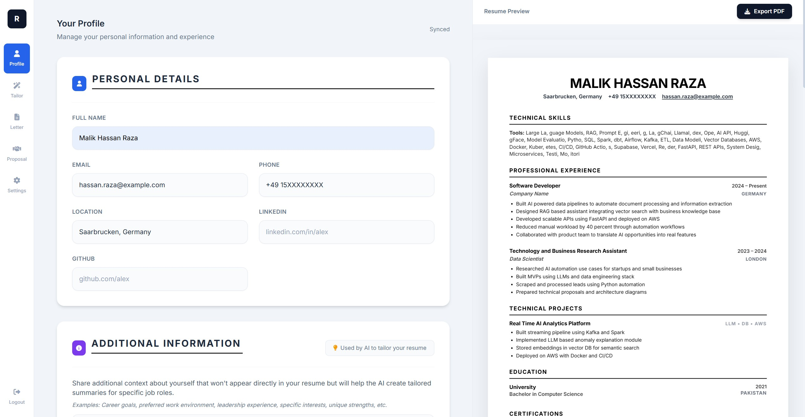
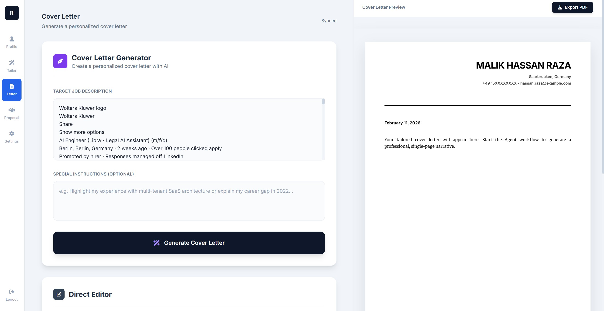

# Resumyx — AI Resume Builder Boilerplate


A full-stack boilerplate for building AI-powered resume tools. This repository provides the complete project structure, authentication system, multi-AI provider architecture, and chat interface — ready for you to plug in your own AI logic.

---

## Screenshots

### Profile & Resume Preview
Manage all resume sections on the left and see a live, print-optimized A4 preview on the right with one-click PDF export.



### AI Resume Tailor
Paste a job description, click **Tailor My Resume**, and watch the agent log stream as each section (Summary, Experience, Skills, Projects, Education, Scoring) is optimized in sequence.


### Cover Letter Generator
Generate a personalized, single-page cover letter from the job description. The preview renders instantly alongside the generator form, ready to export as PDF.



---

## What This Boilerplate Provides

### Fully Implemented
- **User Authentication** — Register, login, JWT token management, password change (Supabase Auth)
- **Resume Profile Management** — CRUD forms for all resume sections (experience, education, skills, projects, certifications)
- **Multi-AI Provider Architecture** — Abstract base class + factory pattern supporting Gemini, OpenAI, and OpenRouter
- **Streaming Chat UI** — Floating chat panel with SSE streaming, context-aware system (CopilotKit-style)
- **Settings Page** — AI provider configuration (users bring their own API keys), password management, diagnostics
- **Resume & Cover Letter Preview** — Print-optimized A4 document previews with PDF export
- **Landing Page** — Marketing homepage with feature highlights

### Stub Implementations (Requires Your AI Prompts)
- **Resume Tailoring** — Endpoint structure ready; fill in AI provider `tailor_*()` methods
- **ATS Scoring** — Scoring class with methods defined; implement the algorithms
- **Cover Letter Generation** — Endpoint and UI ready; implement `generate_cover_letter()`
- **Proposal Generator** — Component scaffold ready; implement `generate_proposal()`
- **Chat Assistant** — SSE endpoint ready; implement `chat_service.stream_chat()`

---

## Architecture

```
┌─────────────────────────────┐
│     React Frontend (Vite)   │
│  TypeScript + Tailwind CSS  │
│  Supabase Auth (client-side)│
└─────────┬───────────────────┘
          │ REST + SSE
┌─────────▼───────────────────┐
│     FastAPI Backend         │
│  JWT Auth + CORS            │
│  AI Service Factory         │
└──────┬──────────┬───────────┘
       │          │
┌──────▼──┐  ┌────▼─────────┐
│ Supabase│  │  AI Provider │
│  DB+Auth│  │  (User's Key)│
└─────────┘  └──────────────┘
```

---

## Tech Stack

| Layer | Technology | Version |
|-------|-----------|---------|
| Frontend Framework | React | 19.x |
| Language | TypeScript | 5.8 |
| Build Tool | Vite | 6.x |
| Styling | Tailwind CSS | 3.x |
| Backend Framework | FastAPI | 0.115 |
| Backend Language | Python | 3.11+ |
| Data Validation | Pydantic | 2.9 |
| Database & Auth | Supabase | PostgreSQL |
| AI (Gemini) | google-generativeai | 0.8 |
| AI (OpenAI) | openai | 1.57 |
| AI (OpenRouter) | httpx (custom) | — |
| PDF Export | jsPDF + html2canvas | — |
| Chat Streaming | Server-Sent Events | Native |

---

## Quick Start

### Prerequisites
- Node.js 18+
- Python 3.11+
- A [Supabase](https://supabase.com) account (free tier works)

### 1. Clone and install frontend dependencies

```bash
git clone https://github.com/your-username/resumyx-public.git
cd resumyx-public
npm install
```

### 2. Install backend dependencies

```bash
cd backend
python -m venv .venv
source .venv/bin/activate  # Windows: .venv\Scripts\activate
pip install -r requirements.txt
```

### 3. Configure environment variables

**Frontend** — copy and edit `.env.example`:
```bash
cp .env.example .env.local
# Edit VITE_API_URL to point to your backend
```

**Backend** — copy and edit `backend/.env.example`:
```bash
cp backend/.env.example backend/.env
# Fill in your Supabase credentials and Gemini API key
```

### 4. Set up Supabase

See [docs/SUPABASE_AUTH_SETUP.md](docs/SUPABASE_AUTH_SETUP.md) for detailed steps.

Create these tables in your Supabase project:

```sql
-- Resume profiles
CREATE TABLE resume_profiles (
    id UUID PRIMARY KEY DEFAULT gen_random_uuid(),
    user_id TEXT NOT NULL UNIQUE,
    profile_data JSONB NOT NULL,
    target_jd TEXT DEFAULT '',
    created_at TIMESTAMPTZ DEFAULT now(),
    updated_at TIMESTAMPTZ DEFAULT now()
);

-- AI provider settings per user
CREATE TABLE ai_settings (
    id UUID PRIMARY KEY DEFAULT gen_random_uuid(),
    user_id UUID REFERENCES auth.users NOT NULL UNIQUE,
    provider_config JSONB NOT NULL,
    created_at TIMESTAMPTZ DEFAULT now(),
    updated_at TIMESTAMPTZ DEFAULT now()
);
```

### 5. Run the application

```bash
# Terminal 1: Start backend
cd backend && uvicorn app.main:app --reload --port 8000

# Terminal 2: Start frontend
npm run dev
```

Open [http://localhost:3000](http://localhost:3000)

---

## Project Structure

```
resumyx-public/
├── src/                          # React frontend
│   ├── App.tsx                   # Main app layout & routing
│   ├── types/
│   │   ├── index.ts              # Domain types (ResumeData, Experience, etc.)
│   │   └── ai-config.ts          # AI provider configuration types
│   ├── contexts/
│   │   ├── AuthContext.tsx       # JWT auth state management
│   │   └── CopilotContext.tsx    # Chat assistant state & streaming
│   ├── services/
│   │   ├── apiService.ts         # REST API client with token refresh
│   │   └── chatService.ts        # SSE streaming chat client
│   └── components/
│       ├── AIBuildPage.tsx       # [STUB] Resume tailoring UI
│       ├── CoverLetterPage.tsx   # [STUB] Cover letter generation UI
│       ├── ProposalPage.tsx      # [STUB] Freelance proposal UI
│       ├── WorkflowPage.tsx      # [STUB] AI workflow visualization
│       ├── ProfilePage.tsx       # Resume data entry forms
│       ├── SettingsPage.tsx      # AI settings + account management
│       ├── ResumePreview.tsx     # Print-optimized resume display
│       ├── CoverLetterPreview.tsx# Print-optimized cover letter
│       ├── LandingPage.tsx       # Marketing homepage
│       ├── LoginPage.tsx         # Login form
│       ├── RegisterPage.tsx      # Registration form
│       └── chat/
│           ├── ChatPanel.tsx     # Slide-in chat interface
│           ├── ChatMessage.tsx   # Message bubble with markdown
│           ├── ChatInput.tsx     # Auto-resizing input
│           └── ChatButton.tsx    # Floating action button
│
├── backend/
│   ├── requirements.txt
│   ├── .env.example
│   └── app/
│       ├── main.py               # FastAPI app setup + CORS
│       ├── core/
│       │   ├── config.py         # Pydantic settings from .env
│       │   └── auth_middleware.py# JWT validation dependency
│       ├── api/
│       │   ├── auth.py           # Register, login, refresh, logout
│       │   ├── routes.py         # Profile CRUD + AI endpoints
│       │   ├── chat_routes.py    # [STUB] SSE chat endpoint
│       │   ├── advanced_routes.py# [STUB] Batch + ranking endpoints
│       │   └── ai_settings_routes.py # AI provider config endpoints
│       ├── models/
│       │   ├── resume.py         # Pydantic schemas for resume data
│       │   ├── auth.py           # Auth request/response schemas
│       │   ├── chat.py           # Chat message schemas
│       │   └── ai_config.py      # AI provider config schemas
│       └── services/
│           ├── base_ai_service.py    # Abstract AI provider interface
│           ├── ai_service_factory.py # Factory pattern for providers
│           ├── gemini_service.py     # [STUB] Google Gemini implementation
│           ├── openai_service.py     # [STUB] OpenAI GPT implementation
│           ├── openrouter_service.py # [STUB] OpenRouter implementation
│           ├── chat_service.py       # [STUB] Chat context builder
│           ├── enhanced_ats_scorer.py# [STUB] ATS scoring algorithms
│           ├── auth_service.py       # Supabase Auth operations
│           ├── supabase_service.py   # Database CRUD
│           └── ai_settings_service.py# User AI config persistence
│
└── docs/
    ├── ARCHITECTURE.md
    ├── DEPLOYMENT.md
    ├── AUTHENTICATION.md
    ├── MULTI_AI_PROVIDER_GUIDE.md
    └── SUPABASE_AUTH_SETUP.md
```

---

## Implementing AI Features

### Step 1: Choose an AI Provider

The architecture uses a **factory pattern** with an **abstract base class**. All providers implement the same interface defined in [backend/app/services/base_ai_service.py](backend/app/services/base_ai_service.py).

### Step 2: Implement Provider Methods

Choose your provider and implement each method:

```python
# backend/app/services/gemini_service.py

class GeminiService(BaseAIService):
    def __init__(self, api_key: str, model: str = "gemini-2.0-flash-exp"):
        super().__init__(api_key, model)
        import google.generativeai as genai
        genai.configure(api_key=api_key)
        self.client = genai.GenerativeModel(model)

    async def tailor_summary(self, additional_info, skills, experience, job_description) -> str:
        prompt = f"""
        You are an expert resume writer. Create a compelling 2-3 sentence professional
        summary tailored to this job description.

        Current summary: {additional_info}
        Skills: {skills}
        Job Description: {job_description}

        Return only the summary text, nothing else.
        """
        response = await self.client.generate_content_async(prompt)
        return response.text.strip()

    # Implement remaining methods...
```

### Step 3: Implement ATS Scoring

After implementing AI services, implement the `EnhancedATSScorer` class:

```python
# backend/app/services/enhanced_ats_scorer.py

def calculate_keyword_match(self, resume_data, job_description) -> Tuple[int, List[str]]:
    # 1. Extract keywords from job description
    # 2. Build searchable text from resume
    # 3. Find matches and calculate percentage
    ...
```

### Step 4: Implement Chat Service

```python
# backend/app/services/chat_service.py

async def stream_chat(self, request, user_id) -> AsyncGenerator[str, None]:
    user_config = await ai_settings_service.get_user_settings(user_id)
    system_prompt = self._build_system_prompt(request.context_data)

    # Stream tokens from your AI provider
    async for token in your_ai_provider.stream(system_prompt, request.message):
        yield f'data: {{"type": "chunk", "content": "{token}"}}\n\n'

    yield 'data: {"type": "done"}\n\n'
```

See [docs/MULTI_AI_PROVIDER_GUIDE.md](docs/MULTI_AI_PROVIDER_GUIDE.md) for a comprehensive guide.

---

## Environment Variables

### Frontend (`.env.local`)

| Variable | Description | Example |
|----------|-------------|---------|
| `VITE_API_URL` | Backend API URL | `http://localhost:8000/api` |

### Backend (`backend/.env`)

| Variable | Required | Description |
|----------|----------|-------------|
| `PORT` | No | Server port (default: 8000) |
| `ENVIRONMENT` | No | `development` or `production` |
| `GEMINI_API_KEY` | Yes* | Google Gemini API key |
| `SUPABASE_URL` | Yes | Your Supabase project URL |
| `SUPABASE_SERVICE_KEY` | Yes | Supabase service role key |
| `SUPABASE_ANON_KEY` | Yes | Supabase anonymous key |
| `SUPABASE_JWT_SECRET` | Yes | Supabase JWT secret |
| `CORS_ORIGINS` | Yes | Allowed origins (comma-separated) |

*Users can also set their own AI API keys via the Settings page.

---

## Deployment

This stack is designed to deploy for free:

| Service | Platform | Free Tier |
|---------|----------|-----------|
| Frontend | [Vercel](https://vercel.com) | Unlimited |
| Backend | [Render](https://render.com) | 750 hrs/month |
| Database | [Supabase](https://supabase.com) | 500MB |

See [docs/DEPLOYMENT.md](docs/DEPLOYMENT.md) for step-by-step deployment instructions.

---

## API Endpoints

| Method | Endpoint | Auth | Description |
|--------|----------|------|-------------|
| `GET` | `/api/health` | No | Health check |
| `POST` | `/api/auth/register` | No | Register user |
| `POST` | `/api/auth/login` | No | Login user |
| `POST` | `/api/auth/refresh` | No | Refresh token |
| `POST` | `/api/auth/logout` | Yes | Logout user |
| `GET` | `/api/auth/verify` | Yes | Verify token |
| `GET` | `/api/profile/{id}` | No | Get profile |
| `POST` | `/api/profile` | No | Save profile |
| `POST` | `/api/ai/tailor-resume` | Yes | Tailor full resume |
| `POST` | `/api/ai/tailor-summary` | Yes | Tailor summary |
| `POST` | `/api/ai/tailor-experience` | Yes | Tailor experience |
| `POST` | `/api/ai/tailor-skills` | Yes | Tailor skills |
| `POST` | `/api/ai/ats-score` | Yes | Calculate ATS score |
| `POST` | `/api/ai/generate-cover-letter` | Yes | Generate cover letter |
| `POST` | `/api/ai/generate-proposal` | Yes | Generate proposal |
| `POST` | `/api/chat/completions` | Yes | Stream chat response |
| `GET` | `/api/ai/settings` | Yes | Get AI settings |
| `POST` | `/api/ai/settings` | Yes | Save AI settings |
| `GET` | `/api/ai/providers` | No | List AI providers |

FastAPI auto-generates interactive API docs at `/docs`.

---

## Contributing

1. Fork the repository
2. Create a feature branch: `git checkout -b feature/my-feature`
3. Commit your changes: `git commit -m "feat: add my feature"`
4. Push to the branch: `git push origin feature/my-feature`
5. Open a pull request

---

## License

MIT License — see [LICENSE](LICENSE) for details.
