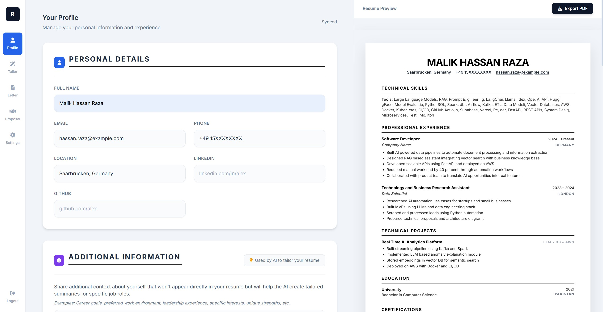
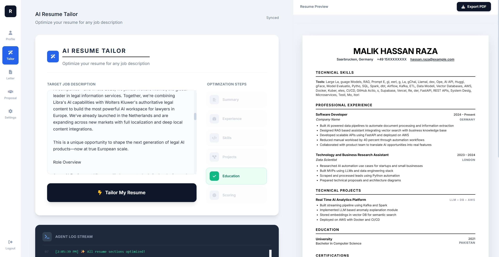
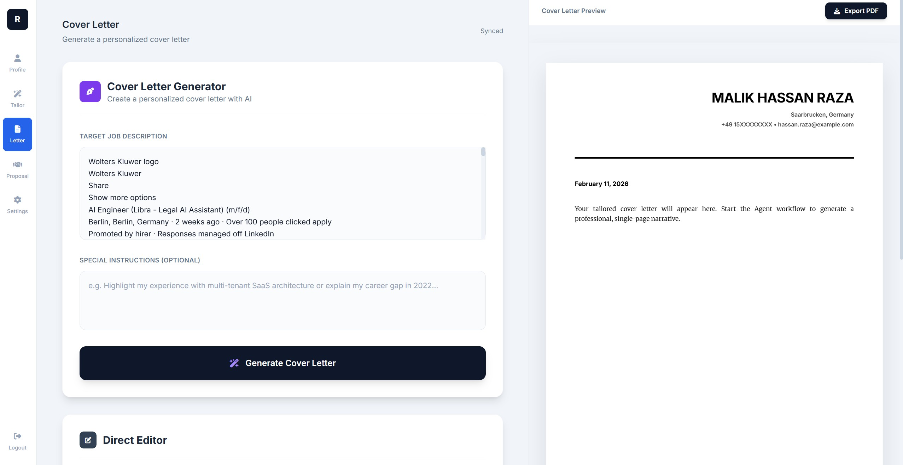

# Resumyx Public


Resumyx Public is a full-stack starter for AI-powered resume products. It gives you the polished product shell: authentication, resume profile management, live document previews, multi-provider AI wiring, chat surfaces, settings, and a landing page that already looks like a real product.

The goal of this repository is simple:

- present the product cleanly in public
- provide a strong starter for forks and experiments
- keep your private prompts, ranking logic, and differentiated workflows out of the shared repo

---

## Screenshots

### Profile Workspace
Manage resume sections on the left and see a print-ready preview on the right.



### AI Tailoring Flow
Paste a job description and use the built-in UI shell for tailoring, scoring, and streaming activity feedback.



### Cover Letter Generator
Generate a one-page companion document with a live preview that is ready to export.



---

## What Is Included

### Product Surfaces
- Landing page with polished product storytelling
- Authentication flow for login and registration
- Resume profile editor for experience, education, skills, projects, and certifications
- Live resume preview and cover letter preview
- Tailoring, proposal, and cover-letter workspaces
- Settings page for bring-your-own-key provider configuration
- Streaming chat shell

### Backend Foundation
- FastAPI application structure
- Supabase-backed authentication and persistence
- Shared AI provider abstraction for Gemini, OpenAI, and OpenRouter
- API client and frontend wiring for profile and AI workflows

### Built To Extend
- Replace stub AI methods with your own prompts and business logic
- Swap providers without rewriting the UI layer
- Keep proprietary workflows in a private repository while reusing this foundation

---

## Intentionally Left For You

This public repository is meant to be safe to share. It does not try to ship every differentiated part of a production product.

- Private prompt strategy
- Custom ranking and scoring heuristics
- Proprietary tracking or internal workflow logic
- Niche automations tied to your own product moat

---

## Tech Stack

| Layer | Technology |
| --- | --- |
| Frontend | React 19, TypeScript, Vite, Tailwind CSS |
| Backend | FastAPI, Pydantic |
| Data and Auth | Supabase |
| AI Provider Layer | Gemini, OpenAI, OpenRouter |
| Export | jsPDF, html2canvas |
| Streaming | Server-Sent Events |

---

## Quick Start

### Prerequisites
- Node.js 18+
- Python 3.11+
- A Supabase project

### 1. Clone and install

```bash
git clone https://github.com/your-username/resumyx-public.git
cd resumyx-public
npm install
```

### 2. Install backend dependencies

```bash
cd backend
python -m venv .venv
source .venv/bin/activate  # Windows: .venv\Scripts\activate
pip install -r requirements.txt
```

### 3. Configure environment variables

Frontend:

```bash
cp .env.example .env.local
```

Backend:

```bash
cp backend/.env.example backend/.env
```

Then fill in your Supabase credentials and backend URL values.

### 4. Run the app

```bash
# Terminal 1
cd backend && uvicorn app.main:app --reload --port 8000

# Terminal 2
npm run dev
```

---

## Project Structure

```text
resumyx-public/
|-- src/
|   |-- App.tsx
|   |-- components/
|   |-- contexts/
|   |-- services/
|   `-- types/
|-- backend/
|   |-- app/
|   `-- requirements.txt
`-- docs/
```

Key frontend files:

- `src/components/LandingPage.tsx`
- `src/components/ProfilePage.tsx`
- `src/components/AIBuildPage.tsx`
- `src/components/CoverLetterPage.tsx`
- `src/components/ProposalPage.tsx`
- `src/components/SettingsPage.tsx`

Key backend areas:

- `backend/app/api/`
- `backend/app/services/`
- `backend/app/models/`

---

## Deployment

This stack is designed to deploy cheaply:

- Frontend on Vercel
- Backend on Render
- Database on Supabase

See `docs/DEPLOYMENT.md` for the deployment guide.

---

## License

MIT License. See `LICENSE` for details.
